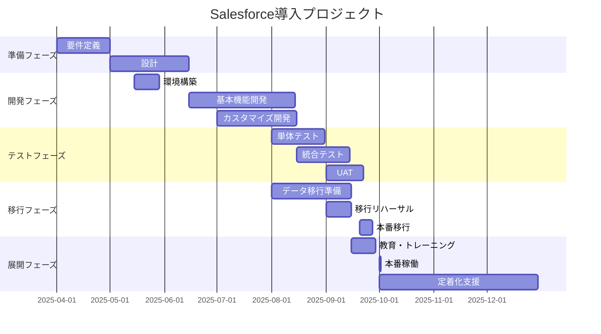

# Salesforce営業支援システム 詳細設計仕様書

## 文書情報
- 文書名: Salesforce営業支援システム 詳細設計仕様書
- 版数: v1.0
- 作成日: 2025-08-14
- 作成者: システム企画部
- 承認者: CTO / 営業本部長 / 情報システム部長
- 適用開始予定: 2025-10-01
- プラットフォーム: Salesforce Sales Cloud / Service Cloud

## 1. システム概要

### 1.1 目的
本システムは、Salesforce Sales Cloudをベースに、営業プロセス全体（商談発生から成約・納品・知識化まで）を最適化し、内部統制要件（J-SOX）への準拠を実現する統合営業支援システムである。

### 1.2 選定理由
- **実績のあるクラウドCRMプラットフォーム**: 世界No.1のCRM
- **豊富な標準機能**: カスタマイズ最小限で要件実現
- **エコシステム**: AppExchangeによる機能拡張
- **AI機能**: Einstein AIによる予測・自動化
- **拡張性**: Apex/Visualforceによる柔軟なカスタマイズ

### 1.3 システム構成
- **基盤**: Salesforce Sales Cloud Enterprise Edition
- **追加ライセンス**: 
  - Sales Cloud Einstein
  - CPQ (Configure, Price, Quote)
  - Pardot (マーケティング連携用)
- **AppExchange製品**:
  - DocuSign (電子署名)
  - Slack for Salesforce
  - TableauCRM (高度な分析)

### 1.4 導入スコープ
- **Phase 1**: コア営業機能（2025年10月）
- **Phase 2**: 高度な分析・AI機能（2026年1月）
- **Phase 3**: マーケティング連携（2026年4月）

## 2. Salesforceオブジェクト設計

### 2.1 標準オブジェクトの活用

#### 2.1.1 取引先（Account）
**用途**: 顧客企業情報の管理
```
標準項目の活用:
- 取引先名
- 業種
- 年間売上
- 従業員数
- Web サイト
- 請求先住所

カスタム項目の追加:
- 決算月__c (選択リスト)
- 上場区分__c (選択リスト)
- 与信限度額__c (通貨)
- 内部統制評価__c (選択リスト: 高/中/低)
- キーアカウントフラグ__c (チェックボックス)
```

#### 2.1.2 取引先責任者（Contact）
**用途**: キーパーソン情報の管理
```
標準項目の活用:
- 姓名
- 役職
- 部署
- メール
- 電話

カスタム項目の追加:
- 影響力レベル__c (1-5の数値)
- 決裁権限__c (チェックボックス)
- 関係性スコア__c (1-100の数値)
- Champion フラグ__c (チェックボックス)
```

#### 2.1.3 商談（Opportunity）
**用途**: 案件管理の中核
```
標準項目の活用:
- 商談名
- 取引先
- 金額
- 確度 (%)
- フェーズ
- 完了予定日
- 次のステップ

カスタム項目の追加:
- 案件番号__c (自動採番: OPP-YYYYMMDD-XXXX)
- 商材カテゴリ__c (選択リスト)
- 競合他社__c (複数選択リスト)
- 高難易度フラグ__c (数式項目で自動判定)
- REDレビュー完了__c (チェックボックス)
- 粗利率__c (%)
- 内部統制チェック__c (チェックボックス)
```

#### 2.1.4 活動（Task/Event）
**用途**: 営業活動の記録
```
標準項目の活用:
- 件名
- 関連先
- 活動日
- 状況

カスタム項目の追加:
- 活動種別__c (訪問/Web会議/電話/メール)
- 議事録__c (リッチテキスト)
- Next Action__c (テキスト)
- SLA違反フラグ__c (数式: 48時間ルール)
```

#### 2.1.5 リード（Lead）
**用途**: 見込み客管理
```
標準項目の活用:
- 会社
- 姓名
- リードソース
- 評価

カスタム項目の追加:
- BANT確認__c (チェックボックス)
- スコアリング点数__c (Einstein Lead Scoring利用)
```

### 2.2 カスタムオブジェクトの設計

#### 2.2.1 提案書（Proposal__c）
```
項目:
- 提案番号__c (自動採番)
- 商談__c (主従関係)
- 版数__c (数値)
- 提案日__c (日付)
- 有効期限__c (日付)
- 提案ステータス__c (ドラフト/レビュー中/承認済/提出済)
- 提案内容__c (リッチテキスト)
- 添付ファイル (Salesforce Files)
```

#### 2.2.2 見積（Quote）- CPQ利用
```
Salesforce CPQの標準機能を活用:
- 見積番号
- 商談リレーション
- 価格計算ルール
- 承認プロセス
- PDF生成

カスタム設定:
- 値引きルール (最大30%、階層別)
- 粗利計算 (カスタム価格ルール)
- 承認マトリックス
```

#### 2.2.3 REDレビュー（RED_Review__c）
```
項目:
- レビューID__c (自動採番)
- 商談__c (参照関係)
- レビュー日時__c (日時)
- 参加者__c (複数選択ユーザー)
- チェックリスト完了率__c (%)
- 指摘事項__c (リッチテキスト)
- 承認ステータス__c (承認/条件付承認/差戻し)
```

#### 2.2.4 契約（Contract）拡張
```
標準オブジェクトを拡張:
- 契約タイプ__c (基本契約/個別契約/NDA)
- 自動更新フラグ__c (チェックボックス)
- 解約予告期間__c (日数)
- 法務レビュー完了__c (チェックボックス)
- DocuSign ステータス__c (外部ID)
```

#### 2.2.5 引継ぎ（Handover__c）
```
項目:
- 引継ぎID__c (自動採番)
- 商談__c (参照関係)
- 引継ぎ日__c (日付)
- PM担当者__c (ユーザー参照)
- チェックリスト__c (25項目のチェックボックス)
- 完了率__c (数式項目)
- 特記事項__c (リッチテキスト)
```

#### 2.2.6 ナレッジ記事（Knowledge）活用
```
Salesforce Knowledgeを活用:
- 記事タイプ: 成功事例/FAQ/Sales Play
- カテゴリ: 業界別/商材別/フェーズ別
- 記事の評価とフィードバック
- AIによる関連記事の推奨
```

## 3. Salesforce機能実装設計

### 3.1 営業プロセス（Sales Path）

#### 3.1.1 商談フェーズ定義
```yaml
フェーズ:
  1. 商談発生:
    - ガイダンス: "48時間以内に初回コンタクト"
    - 必須項目: [取引先, 商談名, 金額, 商材カテゴリ]
    - Next Best Action: "ヒアリングシート送付"
    
  2. 顧客理解:
    - ガイダンス: "BANT-CCの確認"
    - 必須項目: [予算, 決裁者, ニーズ, 時期]
    - Next Best Action: "競合分析実施"
    
  3. 提案準備:
    - ガイダンス: "REDレビュー実施"
    - 必須項目: [提案書, 競合分析, 粗利計算]
    - Next Best Action: "社内レビュー設定"
    
  4. 社内承認:
    - ガイダンス: "稟議承認取得"
    - 必須項目: [見積, 粗利率, リスク評価]
    - Next Best Action: "承認申請提出"
    
  5. 顧客提案:
    - ガイダンス: "提案プレゼン実施"
    - 必須項目: [提案日, 顧客反応, 宿題事項]
    - Next Best Action: "フォローアップ予定"
    
  6. 交渉:
    - ガイダンス: "条件調整と合意形成"
    - 必須項目: [最終条件, 契約予定日]
    - Next Best Action: "契約書準備"
    
  7. 成約:
    - ガイダンス: "契約締結と引継ぎ"
    - 必須項目: [契約書, 引継ぎ文書]
    - Next Best Action: "キックオフ設定"
```

### 3.2 自動化（Process Builder / Flow）

#### 3.2.1 案件登録時の自動処理
```yaml
Flow名: 案件登録自動処理
トリガー: 商談作成時
処理:
  1. 案件番号の自動採番
  2. 専用Chatterグループの作成
  3. 関係者への通知（メール/Chatter）
  4. 高難易度判定（金額5000万以上）
  5. SEの自動アサイン提案
  6. タスクの自動作成（初回連絡）
```

#### 3.2.2 SLA監視フロー
```yaml
Flow名: 48時間SLA監視
スケジュール: 1時間毎
処理:
  1. 新規商談の初回活動チェック
  2. 48時間経過案件の抽出
  3. マネージャーへのエスカレーション
  4. ダッシュボードの更新
  5. Slackへの通知
```

#### 3.2.3 承認プロセス

##### 見積承認プロセス
```yaml
承認プロセス名: 見積承認
開始条件: 見積ステータス = "承認申請"
承認ステップ:
  Step1:
    条件: 値引率 <= 10%
    承認者: 直属上司
  Step2:
    条件: 値引率 <= 20%
    承認者: 営業部長
  Step3:
    条件: 値引率 <= 30%
    承認者: 営業本部長
  Step4:
    条件: 値引率 > 30% OR 粗利率 < 20%
    承認者: 営業本部長 + CFO

自動処理:
  承認時: ステータス更新、顧客送付可能フラグON
  却下時: 差戻し理由の記録、再申請タスク作成
```

##### REDレビュー承認
```yaml
承認プロセス名: REDレビュー承認
開始条件: REDレビュー完了
並列承認:
  - 技術承認: SE部門長
  - 収益承認: 経理部門
  - リスク承認: 法務部門

最終承認: 営業部長
```

### 3.3 レポート・ダッシュボード設計

#### 3.3.1 経営ダッシュボード
```yaml
コンポーネント:
  1. 売上予測（四半期）:
    - タイプ: ゲージチャート
    - データ: 確度別積み上げ
    
  2. パイプライン分析:
    - タイプ: ファネルチャート
    - データ: フェーズ別案件数/金額
    
  3. 営業効率指標:
    - タイプ: KPIカード
    - 指標: 平均商談期間、成約率、平均単価
    
  4. 地域別実績:
    - タイプ: マップ
    - データ: 地域別売上実績
```

#### 3.3.2 営業マネージャーダッシュボード
```yaml
コンポーネント:
  1. チーム別実績:
    - タイプ: 棒グラフ
    - データ: メンバー別達成率
    
  2. 活動量分析:
    - タイプ: ヒートマップ
    - データ: 日別活動数
    
  3. SLA遵守率:
    - タイプ: トレンドライン
    - データ: 48時間ルール遵守率
    
  4. 要注意案件:
    - タイプ: リストビュー
    - 条件: 停滞30日以上、確度低下
```

#### 3.3.3 個人ダッシュボード
```yaml
コンポーネント:
  1. 今月の実績:
    - タイプ: 進捗バー
    - データ: 目標対比
    
  2. 本日のタスク:
    - タイプ: カレンダー
    - データ: 活動予定
    
  3. マイパイプライン:
    - タイプ: カンバン
    - データ: フェーズ別商談
    
  4. 重要通知:
    - タイプ: フィード
    - データ: 承認依頼、期限接近
```

### 3.4 Einstein AI機能の活用

#### 3.4.1 Einstein 商談スコアリング
```yaml
設定:
  学習データ: 過去2年間の商談データ
  予測項目: 成約確率
  更新頻度: 毎日
  
活用方法:
  - 優先順位付け
  - リソース配分最適化
  - 早期警告アラート
```

#### 3.4.2 Einstein 活動キャプチャ
```yaml
連携:
  - Outlook/Gmail自動同期
  - カレンダー連携
  - メール自動記録
  
メリット:
  - 手動入力削減
  - 活動の完全記録
  - 顧客接触履歴の可視化
```

#### 3.4.3 Einstein Next Best Action
```yaml
推奨アクション:
  - 次回連絡タイミング
  - 提案内容の最適化
  - クロスセル/アップセル機会
  - リスク対応策
```

## 4. Lightning Experience UI設計

### 4.1 Lightning アプリケーション

#### 4.1.1 営業支援アプリ
```yaml
名称: 営業支援センター
ナビゲーション項目:
  - ホーム（ダッシュボード）
  - 商談
  - 取引先
  - 活動
  - レポート
  - 承認
  - ナレッジ
  
ユーティリティバー:
  - Chatter
  - 最近のレコード
  - メモ
  - 電話（CTI統合）
```

### 4.2 Lightning ページレイアウト

#### 4.2.1 商談レコードページ
```yaml
構成: 3カラムレイアウト

左カラム:
  - 商談ハイライトパネル
  - 重要指標（金額、確度、期日）
  - Einstein スコア
  
中央カラム:
  - Sales Path
  - 詳細情報タブ
  - 活動タイムライン
  - Chatterフィード
  
右カラム:
  - 関連リスト
  - Next Best Action
  - 関連ナレッジ記事
```

#### 4.2.2 取引先レコードページ
```yaml
構成: 2カラムレイアウト

左カラム（70%）:
  - 会社概要
  - 商談履歴
  - 活動履歴
  - 契約一覧
  
右カラム（30%）:
  - キーパーソンマップ
  - 関係性スコア
  - 競合情報
```

### 4.3 Lightning コンポーネント開発

#### 4.3.1 カスタムコンポーネント一覧
```javascript
// 粗利計算コンポーネント
Component: GrossMarginCalculator
機能:
  - リアルタイム粗利計算
  - 値引き影響シミュレーション
  - 承認要否の自動判定

// REDレビューチェックリスト
Component: REDReviewChecklist
機能:
  - 20項目のチェックリスト
  - 進捗率の可視化
  - 必須項目の検証

// 競合分析マトリックス
Component: CompetitiveMatrix
機能:
  - 競合比較表
  - 強み/弱み分析
  - 差別化ポイント表示

// 引継ぎダッシュボード
Component: HandoverDashboard
機能:
  - チェックリスト進捗
  - 関連ドキュメント一覧
  - タスク管理
```

## 5. 統合・連携設計

### 5.1 内部システム連携

#### 5.1.1 会計システム連携
```yaml
連携方式: MuleSoft Anypoint Platform
同期方法: 
  - リアルタイム: 受注情報
  - バッチ: 請求/入金データ（日次）
  
データマッピング:
  Salesforce → 会計:
    - 商談.成約 → 売上計上
    - 取引先 → 得意先マスタ
    - 契約 → 請求情報
    
  会計 → Salesforce:
    - 入金情報 → 支払履歴
    - 与信情報 → 取引先.与信限度額
```

#### 5.1.2 基幹システム連携
```yaml
連携方式: Salesforce Connect (OData)
データソース:
  - 製品マスタ
  - 在庫情報
  - 納期情報
  
リアルタイム参照:
  - 外部オブジェクトとして参照
  - キャッシュ設定: 1時間
```

### 5.2 外部サービス連携

#### 5.2.1 DocuSign統合
```yaml
用途: 電子契約
連携方式: DocuSign for Salesforce (AppExchange)
フロー:
  1. Salesforceから契約書送信
  2. 署名ステータスリアルタイム同期
  3. 完了文書の自動保存
  4. 契約レコードの自動更新
```

#### 5.2.2 Slack統合
```yaml
用途: リアルタイムコラボレーション
連携方式: Slack for Salesforce
機能:
  - 商談更新通知
  - 承認依頼アラート
  - Slackからの商談更新
  - スウォームミーティング調整
```

#### 5.2.3 Microsoft 365統合
```yaml
Outlook連携:
  - カレンダー同期
  - メール自動記録
  - 会議設定
  
Teams連携:
  - 商談チャネル作成
  - ファイル共有
  - Web会議連携
```

### 5.3 API設計

#### 5.3.1 REST API公開
```yaml
エンドポイント:
  /services/apexrest/opportunity
  /services/apexrest/account
  /services/apexrest/quote
  
認証: OAuth 2.0
レート制限: 
  - 1時間あたり15,000リクエスト
  - 同時接続数: 25
  
セキュリティ:
  - IP制限
  - プロファイルベースアクセス制御
```

#### 5.3.2 Platform Events
```yaml
イベント定義:
  OpportunityStatusChange__e:
    - 商談ID
    - 旧ステータス
    - 新ステータス
    - 変更日時
    
  ApprovalRequest__e:
    - 承認ID
    - 申請者
    - 承認者
    - 期限
    
サブスクライバー:
  - 外部システム通知
  - リアルタイムダッシュボード更新
```

## 6. セキュリティ・コンプライアンス設計

### 6.1 Salesforceセキュリティ設定

#### 6.1.1 認証・アクセス制御
```yaml
認証設定:
  - 多要素認証（MFA）必須
  - SSO（SAML 2.0）
  - セッションタイムアウト: 2時間
  - IPアドレス制限
  
パスワードポリシー:
  - 最小長: 10文字
  - 複雑性: 大小英数字記号必須
  - 有効期限: 90日
  - 履歴: 過去5回使用不可
```

#### 6.1.2 プロファイル・権限セット
```yaml
プロファイル定義:
  営業担当者:
    - 商談: 作成/参照/編集
    - 見積: 作成/参照
    - 契約: 参照のみ
    
  営業マネージャー:
    - 全オブジェクト: フルアクセス
    - レポート: 作成/編集
    - ダッシュボード: 作成/編集
    
  システム管理者:
    - 全機能アクセス
    - 設定変更権限
    
権限セット:
  承認者権限:
    - 承認プロセス実行
    - 見積承認
    
  データエクスポート権限:
    - レポートエクスポート
    - データローダー使用
```

### 6.2 データセキュリティ

#### 6.2.1 共有ルール
```yaml
組織の共有設定:
  取引先: 非公開
  商談: 非公開
  契約: 非公開
  
共有ルール:
  ルール1:
    条件: 商談所有者の部署
    共有先: 同一部署メンバー
    アクセス: 参照のみ
    
  ルール2:
    条件: 商談金額 > 5000万円
    共有先: 経営層ロール
    アクセス: 参照/編集
```

#### 6.2.2 項目レベルセキュリティ
```yaml
機密項目の制御:
  粗利率__c:
    営業担当: 非表示
    マネージャー: 参照のみ
    経理: 編集可能
    
  原価情報__c:
    営業担当: 非表示
    マネージャー: 参照のみ
    経理: 編集可能
```

#### 6.2.3 暗号化
```yaml
Shield Platform Encryption:
  暗号化項目:
    - 個人情報（メール、電話）
    - 金額情報
    - 契約条件
    
  暗号化方式:
    - AES-256
    - 鍵管理: Salesforce Shield
    - 鍵ローテーション: 年次
```

### 6.3 監査・コンプライアンス

#### 6.3.1 監査証跡
```yaml
セットアップ監査証跡:
  - 設定変更履歴: 6ヶ月
  - ダウンロード可能
  
項目履歴管理:
  対象項目:
    - 金額
    - フェーズ
    - 確度
    - 承認ステータス
  保存期間: 18ヶ月
  
ログインHistory:
  - 全ログイン記録
  - 失敗試行記録
  - IPアドレス記録
```

#### 6.3.2 J-SOX対応
```yaml
統制活動:
  予防的統制:
    - 承認プロセス必須化
    - 権限分離
    - 自動検証ルール
    
  発見的統制:
    - 例外レポート
    - 定期棚卸し
    - アクセスレビュー
    
証跡管理:
  - 承認履歴の完全保存
  - 変更履歴の記録
  - レポートスナップショット
```

## 7. データ移行計画

### 7.1 移行対象データ

#### 7.1.1 データ量見積もり
```yaml
マスタデータ:
  取引先: 50,000件
  取引先責任者: 150,000件
  商材: 500件
  ユーザー: 300件
  
トランザクションデータ:
  商談: 100,000件（3年分）
  活動: 500,000件
  契約: 20,000件
  見積: 80,000件
```

#### 7.1.2 データマッピング
```yaml
既存システム → Salesforce:
  顧客マスタ → Account
  担当者マスタ → Contact
  案件データ → Opportunity
  活動履歴 → Task/Event
  契約データ → Contract
```

### 7.2 移行方式

#### 7.2.1 移行ツール
```yaml
使用ツール:
  - Salesforce Data Loader
  - MuleSoft DataWeave
  - カスタムETLスクリプト（Python）
  
移行順序:
  1. マスタデータ（依存関係順）
  2. オープン商談
  3. 活動履歴（直近1年）
  4. クローズ商談
  5. 契約・見積
```

#### 7.2.2 移行スケジュール
```yaml
Phase 1: 準備（1ヶ月）
  - データクレンジング
  - マッピング確定
  - 移行スクリプト開発
  
Phase 2: テスト移行（2週間）
  - Sandbox環境への移行
  - データ検証
  - パフォーマンステスト
  
Phase 3: 本番移行（1週間）
  - 週末実施
  - 段階移行
  - 検証・ロールバック準備
```

## 8. 開発ガイドライン

### 8.1 Apex開発標準

#### 8.1.1 命名規則
```apex
// クラス名: PascalCase
public class OpportunityTriggerHandler {
    
    // メソッド名: camelCase
    public void handleAfterInsert(List<Opportunity> newOpps) {
        
        // 変数名: camelCase
        Set<Id> accountIds = new Set<Id>();
        
        // 定数: UPPER_SNAKE_CASE
        private static final Integer MAX_RETRY_COUNT = 3;
    }
}
```

#### 8.1.2 トリガーフレームワーク
```apex
// トリガー
trigger OpportunityTrigger on Opportunity (
    before insert, before update,
    after insert, after update
) {
    OpportunityTriggerHandler handler = new OpportunityTriggerHandler();
    handler.run();
}

// ハンドラークラス
public class OpportunityTriggerHandler extends TriggerHandler {
    
    protected override void afterInsert() {
        createInitialTasks();
        notifyStakeholders();
        calculateHighDifficulty();
    }
    
    private void createInitialTasks() {
        // 初回連絡タスク作成
    }
}
```

#### 8.1.3 テストクラス
```apex
@isTest
private class OpportunityTriggerTest {
    
    @testSetup
    static void setup() {
        // テストデータ作成
    }
    
    @isTest
    static void testInitialTaskCreation() {
        // テストロジック
        System.assertEquals(expected, actual);
    }
    
    // カバレッジ目標: 85%以上
}
```

### 8.2 Lightning Web Components開発

#### 8.2.1 コンポーネント構造
```javascript
// grossMarginCalculator.js
import { LightningElement, api, wire } from 'lwc';
import calculateGrossMargin from '@salesforce/apex/GrossMarginController.calculate';

export default class GrossMarginCalculator extends LightningElement {
    @api recordId;
    @api amount;
    
    grossMargin = 0;
    grossMarginRate = 0;
    
    handleCalculate() {
        calculateGrossMargin({ 
            opportunityId: this.recordId,
            amount: this.amount
        })
        .then(result => {
            this.grossMargin = result.margin;
            this.grossMarginRate = result.rate;
        })
        .catch(error => {
            this.handleError(error);
        });
    }
}
```

### 8.3 ガバナ制限対策

#### 8.3.1 SOQL最適化
```apex
// Bad: N+1クエリ
for(Opportunity opp : opportunities) {
    Account acc = [SELECT Name FROM Account WHERE Id = :opp.AccountId];
}

// Good: バルククエリ
Map<Id, Account> accountMap = new Map<Id, Account>(
    [SELECT Id, Name FROM Account WHERE Id IN :accountIds]
);
```

#### 8.3.2 非同期処理
```apex
// Queueable Apex
public class AsyncOpportunityProcessor implements Queueable {
    
    public void execute(QueueableContext context) {
        // 重い処理を非同期実行
    }
}

// Platform Event
OpportunityStatusChange__e event = new OpportunityStatusChange__e(
    OpportunityId__c = opp.Id,
    NewStatus__c = opp.StageName
);
EventBus.publish(event);
```

## 9. テスト戦略

### 9.1 テスト計画

#### 9.1.1 テストレベル
```yaml
単体テスト:
  - Apexテストクラス: カバレッジ85%以上
  - LWC: Jest使用、カバレッジ80%以上
  
統合テスト:
  - エンドツーエンドシナリオ
  - 外部システム連携
  - 承認プロセス
  
UAT（ユーザー受入テスト）:
  - 実業務シナリオ
  - 2週間実施
  - 50ケース以上
```

#### 9.1.2 パフォーマンステスト
```yaml
負荷テスト:
  - 同時ユーザー: 500人
  - データ量: 本番相当
  - レスポンス目標: 3秒以内
  
ボリュームテスト:
  - 商談: 500,000件
  - 活動: 2,000,000件
  - ストレージ: 500GB
```

### 9.2 テスト環境

#### 9.2.1 Sandbox戦略
```yaml
Developer Sandbox:
  - 用途: 個人開発
  - データ: 最小限
  - リフレッシュ: 随時
  
Developer Pro Sandbox:
  - 用途: 統合テスト
  - データ: テストデータセット
  - リフレッシュ: 週次
  
Partial Copy Sandbox:
  - 用途: UAT
  - データ: 本番サンプル
  - リフレッシュ: 月次
  
Full Sandbox:
  - 用途: 本番リハーサル
  - データ: 本番コピー
  - リフレッシュ: 四半期
```

## 10. 運用・保守

### 10.1 運用体制

#### 10.1.1 サポート体制
```yaml
L1サポート:
  - Salesforceヘルプデスク
  - 対応時間: 平日9:00-18:00
  - 初期切り分け
  
L2サポート:
  - Salesforce管理者
  - 設定変更、ユーザー管理
  - 軽微なカスタマイズ
  
L3サポート:
  - 開発チーム
  - 複雑な問題解決
  - 新機能開発
```

#### 10.1.2 運用タスク
```yaml
日次:
  - バックアップ確認
  - エラーログ確認
  - データ同期監視
  
週次:
  - ストレージ使用量確認
  - パフォーマンス分析
  - セキュリティレビュー
  
月次:
  - ライセンス棚卸し
  - アクセス権限レビュー
  - ガバナ制限確認
```

### 10.2 変更管理

#### 10.2.1 リリース管理
```yaml
リリースサイクル:
  - 定期リリース: 月1回
  - 緊急リリース: 随時
  
リリースプロセス:
  1. 変更セット作成
  2. Sandboxでテスト
  3. CAB承認
  4. 本番デプロイ
  5. 事後検証
```

#### 10.2.2 Salesforceリリース対応
```yaml
年3回のメジャーリリース:
  Spring: 2月
  Summer: 6月
  Winter: 10月
  
対応:
  - リリースノート確認
  - Sandbox事前テスト
  - 影響分析
  - ユーザー通知
```

## 11. 教育・定着化

### 11.1 トレーニング計画

#### 11.1.1 役割別トレーニング
```yaml
営業担当者向け:
  - 基本操作: 4時間
  - 商談管理: 2時間  
  - レポート活用: 2時間
  - モバイル利用: 1時間
  
マネージャー向け:
  - ダッシュボード: 2時間
  - 承認管理: 1時間
  - チーム管理: 2時間
  
管理者向け:
  - システム管理: 8時間
  - カスタマイズ: 8時間
  - トラブルシューティング: 4時間
```

#### 11.1.2 教材・資料
```yaml
ドキュメント:
  - クイックスタートガイド
  - 操作マニュアル
  - FAQ集
  - Tips集
  
動画コンテンツ:
  - 基本操作動画
  - 機能別チュートリアル
  
Trailhead:
  - カスタムTrailmix作成
  - バッジ取得推奨
```

### 11.2 定着化施策

#### 11.2.1 フェーズ別施策
```yaml
導入期（1-2ヶ月）:
  - フロアサポート配置
  - 日次Q&Aセッション
  - クイックウィン事例共有
  
定着期（3-6ヶ月）:
  - パワーユーザー育成
  - ベストプラクティス共有
  - 利用率モニタリング
  
発展期（7ヶ月以降）:
  - 高度機能活用
  - ユーザー提案制度
  - 継続的改善
```

## 12. ROI・効果測定

### 12.1 期待効果

#### 12.1.1 定量効果
```yaml
業務効率化:
  - 案件登録時間: 50%削減
  - レポート作成: 70%削減
  - 承認プロセス: 60%短縮
  
売上向上:
  - 商談成約率: 15%向上
  - 平均商談期間: 20%短縮
  - クロスセル率: 25%向上
  
コスト削減:
  - システム統合によるIT費用: 30%削減
  - ペーパーレス化: 年間200万円削減
```

#### 12.1.2 定性効果
```yaml
- 顧客情報の一元化
- リアルタイムな情報共有
- データドリブンな意思決定
- 内部統制の強化
- 顧客満足度向上
```

### 12.2 KPI設定

#### 12.2.1 システムKPI
```yaml
利用率:
  - ログイン率: 95%以上
  - データ入力率: 90%以上
  - モバイル利用率: 60%以上
  
品質:
  - データ完全性: 95%以上
  - システム稼働率: 99.9%
  - ユーザー満足度: 4.0/5.0
```

#### 12.2.2 ビジネスKPI  
```yaml
営業生産性:
  - 一人当たり商談数: 20%増
  - 商談成約率: 35%以上
  - 営業サイクル: 90日以内
  
収益性:
  - 粗利率: 30%以上
  - 新規/既存比率: 3:7
  - LTV向上率: 15%
```

## 13. プロジェクトスケジュール

### 13.1 全体スケジュール



### 13.2 マイルストーン

| 日付 | マイルストーン | 成果物 |
|------|--------------|--------|
| 2025-04-30 | 要件定義完了 | 要件定義書 |
| 2025-06-15 | 設計完了 | 詳細設計書 |
| 2025-08-31 | 開発完了 | ソースコード、単体テスト結果 |
| 2025-09-22 | UAT完了 | UAT結果報告書 |
| 2025-09-27 | 移行完了 | 移行結果報告書 |
| 2025-10-01 | 本番稼働 | カットオーバー確認書 |
| 2025-12-31 | 定着化完了 | 効果測定レポート |

## 14. リスク管理

### 14.1 主要リスクと対策

| リスク | 影響度 | 発生確率 | 対策 |
|--------|--------|----------|------|
| データ移行の失敗 | 高 | 中 | 複数回のリハーサル実施、ロールバック計画策定 |
| ユーザー抵抗 | 高 | 中 | 早期からの巻き込み、段階的展開、インセンティブ設計 |
| カスタマイズ過多 | 中 | 高 | 標準機能優先、定期的なレビュー |
| 外部連携の遅延 | 中 | 中 | 早期のI/F仕様確定、並行開発 |
| ライセンス不足 | 低 | 中 | 利用予測の精査、段階的追加 |

## 15. 予算計画

### 15.1 初期投資

| 項目 | 数量 | 単価 | 金額（万円） |
|------|------|------|------------|
| Sales Cloud EE | 300 | 18,000円/月 | 648 |
| CPQ | 100 | 9,000円/月 | 108 |
| Einstein | 300 | 6,000円/月 | 216 |
| 導入支援（SI） | 6ヶ月 | - | 3,000 |
| 教育・トレーニング | 一式 | - | 500 |
| **合計** | | | **4,472** |

### 15.2 年間運用費

| 項目 | 金額（万円/年） |
|------|--------------|
| ライセンス費用 | 972 |
| 保守サポート | 600 |
| 追加開発 | 400 |
| **合計** | **1,972** |

## 16. 成功要因

### 16.1 クリティカルサクセスファクター

1. **経営層のコミットメント**
   - トップダウンでの推進
   - 明確なビジョン共有

2. **標準機能の最大活用**
   - カスタマイズ最小化
   - ベストプラクティス採用

3. **段階的な展開**
   - パイロット部門での成功
   - 横展開による拡大

4. **継続的な改善**
   - ユーザーフィードバック収集
   - 定期的な機能追加

5. **データ品質の維持**
   - データガバナンス確立
   - 定期的なクレンジング

## 17. 付録

### 17.1 用語集

| 用語 | 説明 |
|------|------|
| Sales Cloud | Salesforceの営業支援クラウドサービス |
| Lightning Experience | Salesforceの最新UI |
| Apex | Salesforceのプログラミング言語 |
| SOQL | Salesforce Object Query Language |
| Trailhead | Salesforceの学習プラットフォーム |
| Governor Limits | Salesforceのリソース制限 |
| Shield | Salesforceの高度なセキュリティ機能 |

### 17.2 参考資料

- Salesforce実装ガイド
- Salesforce開発者ガイド
- Trailhead学習パス
- AppExchangeカタログ
- 営業マニュアル v1.0
- 内部統制対応業務記述書 v1.0

---

本仕様書は、Salesforceを活用した営業支援システムの設計・開発・運用における指針として使用される。
実装時には、Salesforceのベストプラクティスに従い、標準機能を最大限活用することを原則とする。

以上