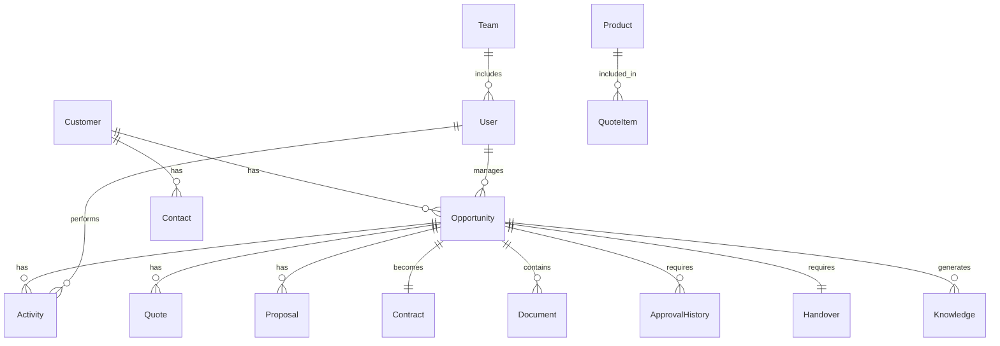

# 営業支援システム（SFA）詳細設計仕様書

## 文書情報
- 文書名：営業支援システム詳細設計仕様書
- バージョン：1.0
- 作成日：2025-01-14
- 作成者：システム設計チーム
- 承認者：IT部門長、営業本部長、内部統制推進室長

## 改訂履歴
| 版数 | 日付 | 改訂内容 | 作成者 | 承認者 |
|------|------|----------|--------|--------|
| 1.0 | 2025-01-14 | 初版作成 | システム設計チーム | - |

---

## 1. システム概要

### 1.1 目的
本システムは、営業プロセス全体（商談発生から成約・納品・知識化まで）を統合管理し、業務効率化、内部統制強化、営業生産性向上を実現する。

### 1.2 スコープ
- **対象業務**：商談管理、顧客管理、提案管理、見積・契約管理、引継ぎ管理、ナレッジ管理
- **対象組織**：営業部門（Inside Sales/Field Sales/Solution Sales）、SE、営業企画、経理、法務、テクニカルサポート、導入グループ
- **対象プロセス**：Day0（商談発生）からナレッジ化までの全営業プロセス

### 1.3 システム方針
- クラウドファースト（SaaS活用優先）
- モバイル対応（レスポンシブデザイン）
- API連携による既存システムとの統合
- リアルタイムダッシュボード
- 内部統制（J-SOX）準拠

---

## 2. 機能要件

### 2.1 案件管理機能

#### 2.1.1 案件登録
**機能ID**: F-001  
**概要**: 新規商談を案件として登録し、自動採番により一意の案件番号を付与

**詳細仕様**:
- 必須入力項目
  - 顧客名（マスタから選択）
  - 案件名（最大100文字）
  - 商品/サービス（複数選択可）
  - 予想受注額（数値、通貨単位：円）
  - 受注確度（10%刻みのプルダウン）
  - 受注予定日（カレンダー選択）
  - 担当営業（ユーザマスタから選択）
  
- 自動処理
  - 案件番号自動採番（形式：OPP-YYYYMMDD-XXXX）
  - 登録日時の自動記録
  - 専用フォルダの自動生成
  - 初期ステータス「商談開始」の設定
  
- バリデーション
  - 受注予定日は本日以降
  - 予想受注額は0以上
  - 重複案件チェック（顧客×商品×期間）

#### 2.1.2 案件ステータス管理
**機能ID**: F-002  
**概要**: 案件の進捗状況を管理し、フェーズごとの必須タスクを制御

**ステータス遷移**:
```
商談開始 → 顧客理解 → 提案準備 → 社内承認 → 顧客提案 → 交渉中 → 成約/失注 → 納品 → 完了
```

**フェーズ別必須タスク**:
- 商談開始：案件登録完了、初回活動記録
- 顧客理解：議事録登録、BANT情報入力
- 提案準備：提案書アップロード、概算見積作成
- 社内承認：REDレビュー完了、稟議承認
- 顧客提案：提出記録、フォローアップ予定
- 成約：契約書登録、引継ぎチェックリスト
- 完了：ナレッジ登録

#### 2.1.3 高難易度案件判定
**機能ID**: F-003  
**概要**: 案件の難易度を自動判定し、必要なリソースとプロセスを決定

**判定基準**:
- 金額閾値：5000万円以上
- 新規顧客フラグ
- カスタマイズ要否
- 競合状況（3社以上）
- 納期（3ヶ月以内）

**判定後アクション**:
- 高難易度：キックオフ会議必須、SE割当必須、週次レビュー
- 中難易度：SE割当推奨、隔週レビュー
- 低難易度：営業単独可、月次レビュー

### 2.2 顧客管理機能

#### 2.2.1 顧客情報管理
**機能ID**: F-004  
**概要**: 顧客の基本情報、取引履歴、キーパーソン情報を一元管理

**管理項目**:
- 基本情報
  - 会社名、業種、規模、上場区分
  - 本社所在地、事業所一覧
  - 決算期、売上高、従業員数
  - Webサイト、企業コード
  
- キーパーソン情報
  - 氏名、部署、役職、権限レベル
  - 連絡先（電話、メール）
  - 決裁権限有無
  - 関係性スコア（1-5）
  - 最終接触日、接触履歴
  
- 取引情報
  - 累計受注額、案件数
  - 主要導入製品
  - 競合導入状況
  - 与信限度額、支払条件

#### 2.2.2 活動履歴管理
**機能ID**: F-005  
**概要**: 顧客との全ての接触履歴を時系列で記録・参照

**記録項目**:
- 活動種別（訪問/Web会議/電話/メール）
- 日時、所要時間
- 参加者（自社/顧客）
- 活動内容（最大2000文字）
- 次回アクション
- 添付ファイル（議事録等）

### 2.3 提案管理機能

#### 2.3.1 提案書作成支援
**機能ID**: F-006  
**概要**: テンプレートベースの提案書作成と版管理

**機能詳細**:
- テンプレート管理
  - 業種別、ソリューション別テンプレート
  - 成功事例の自動挿入
  - 会社ロゴ、定型文の自動設定
  
- 版管理
  - 自動版番号付与（v1.0, v1.1...）
  - 変更履歴の記録
  - 版間差分表示
  - ロールバック機能

#### 2.3.2 REDレビュー管理
**機能ID**: F-007  
**概要**: Review-Edit-Decisionプロセスの実施と記録

**レビュー項目**:
- 提案内容の妥当性
- 競合優位性の明確化
- 価格設定の適正性
- リスク評価
- 想定問答の網羅性

**レビュー記録**:
- 参加者、日時
- 指摘事項と対応状況
- 承認/条件付承認/差戻し
- 改善ToDoリスト

### 2.4 見積・契約管理機能

#### 2.4.1 見積作成
**機能ID**: F-008  
**概要**: 標準価格表に基づく見積作成と粗利計算

**機能詳細**:
- 価格計算
  - 製品/サービス単価×数量
  - ボリュームディスカウント自動適用
  - オプション料金加算
  - 期間按分計算
  
- 粗利シミュレーション
  - 原価自動計算
  - 粗利額/粗利率表示
  - 値引き影響シミュレーション
  - 閾値アラート（粗利率20%未満）

#### 2.4.2 承認ワークフロー
**機能ID**: F-009  
**概要**: 金額・条件に応じた多段階承認フロー

**承認ルート**:
```
金額別：
- 500万円未満：課長承認
- 5000万円未満：部長承認 → 経理承認
- 5000万円以上：本部長承認 → 経理部長承認 → 法務承認

値引き率別：
- 10%未満：課長承認
- 20%未満：部長承認
- 20%以上：本部長承認 → 経理承認
```

**承認機能**:
- 承認/差戻し/条件付承認
- コメント機能
- 代理承認設定
- 承認期限アラート
- 承認履歴の完全記録

#### 2.4.3 契約管理
**機能ID**: F-010  
**概要**: 契約書の作成、レビュー、締結管理

**管理項目**:
- 契約種別（基本契約/個別契約/覚書）
- 契約期間、自動更新条項
- 契約金額、支払条件
- SLA条項
- 法務レビュー履歴
- 電子署名連携

### 2.5 引継ぎ管理機能

#### 2.5.1 引継ぎチェックリスト
**機能ID**: F-011  
**概要**: 営業から実装・サポートチームへの確実な引継ぎ

**チェック項目**:
- 顧客情報の完全性
- 技術要件書
- 約束事項一覧
- リスク事項
- 体制図
- スケジュール
- 特記事項

#### 2.5.2 プロジェクト連携
**機能ID**: F-012  
**概要**: PMツールとの連携によるプロジェクト自動生成

**連携内容**:
- プロジェクト基本情報
- WBS雛形の適用
- リソース初期割当
- マイルストーン設定

### 2.6 ナレッジ管理機能

#### 2.6.1 成功事例登録
**機能ID**: F-013  
**概要**: Sales Playとしての成功事例蓄積と活用

**登録項目**:
- 顧客課題
- 提案内容
- 成功要因
- 定量効果
- 教訓（Good/Bad/Next）
- 横展開ポイント

#### 2.6.2 ナレッジ検索
**機能ID**: F-014  
**概要**: 類似案件、成功事例の高速検索

**検索条件**:
- 業種、規模
- 課題キーワード
- 製品/サービス
- 競合状況
- 成約金額レンジ

### 2.7 ダッシュボード・レポート機能

#### 2.7.1 リアルタイムダッシュボード
**機能ID**: F-015  
**概要**: KPIのリアルタイム可視化

**表示項目**:
- パイプライン（フェーズ別案件数/金額）
- 受注予測（月次/四半期）
- 活動量（訪問数、提案数）
- 成約率、平均商談期間
- 営業別/チーム別実績

#### 2.7.2 定型レポート
**機能ID**: F-016  
**概要**: 定期レポートの自動生成と配信

**レポート種別**:
- 日次：活動サマリー
- 週次：案件進捗、SLA遵守状況
- 月次：受注実績、パイプライン分析
- 四半期：ナレッジ活用状況

### 2.8 内部統制機能

#### 2.8.1 監査証跡管理
**機能ID**: F-017  
**概要**: J-SOX対応の監査証跡自動記録

**記録内容**:
- 全データの変更履歴
- ログイン/アクセス履歴
- 承認履歴
- 例外処理記録
- データエクスポート履歴

#### 2.8.2 コンプライアンスチェック
**機能ID**: F-018  
**概要**: 規程違反の自動検知とアラート

**チェック項目**:
- 職務分掌違反
- 承認権限逸脱
- SLA違反
- 必須プロセススキップ
- 異常な値引き/粗利率

---

## 3. 非機能要件

### 3.1 性能要件

#### 3.1.1 レスポンスタイム
- オンライン処理：3秒以内（95%タイル）
- 検索処理：5秒以内（95%タイル）
- レポート生成：30秒以内
- バッチ処理：日次バッチ6時間以内

#### 3.1.2 スループット
- 同時接続数：1,000ユーザ
- トランザクション：1,000件/分
- API呼出し：10,000回/時

#### 3.1.3 データ容量
- 案件データ：100万件/年
- 活動履歴：1,000万件/年
- 添付ファイル：10TB/年
- 保存期間：7年（契約は契約期間+7年）

### 3.2 可用性要件

#### 3.2.1 稼働率
- 目標稼働率：99.9%（年間ダウンタイム8.76時間以内）
- 計画停止：月1回、深夜2時間以内
- RTO（目標復旧時間）：4時間
- RPO（目標復旧時点）：1時間

#### 3.2.2 冗長性
- サーバ：Active-Standby構成
- データベース：レプリケーション
- ネットワーク：冗長化
- バックアップ：日次フルバックアップ、時間差分バックアップ

### 3.3 セキュリティ要件

#### 3.3.1 認証・認可
- 多要素認証（MFA）必須
- シングルサインオン（SSO）対応
- ロールベースアクセス制御（RBAC）
- 最小権限の原則
- セッションタイムアウト（30分）

#### 3.3.2 暗号化
- 通信：TLS 1.3以上
- データ保存：AES-256
- パスワード：bcryptハッシュ化
- 個人情報：項目レベル暗号化

#### 3.3.3 監査・ログ
- アクセスログ：全画面遷移、データ参照
- 操作ログ：CRUD操作、承認操作
- セキュリティログ：ログイン試行、権限変更
- ログ保存期間：7年
- 改竄防止：ログの暗号化とハッシュチェーン

### 3.4 ユーザビリティ要件

#### 3.4.1 画面設計
- レスポンシブデザイン（PC/タブレット/スマートフォン対応）
- 直感的なUI（学習時間2時間以内）
- ショートカットキー対応
- 多言語対応（日本語/英語）

#### 3.4.2 アクセシビリティ
- WCAG 2.1 Level AA準拠
- スクリーンリーダー対応
- キーボードナビゲーション
- 色覚多様性対応

### 3.5 保守性要件

#### 3.5.1 システム監視
- 死活監視：1分間隔
- リソース監視：CPU、メモリ、ディスク
- アプリケーション監視：エラー率、レスポンス
- 通知：メール、Slack、PagerDuty連携

#### 3.5.2 保守作業
- オンラインメンテナンス機能
- ローリングアップデート対応
- 設定変更の動的反映
- テスト環境の常設

---

## 4. データモデル

### 4.1 ER図概要



### 4.2 主要テーブル定義

#### 4.2.1 案件テーブル（opportunities）
| カラム名 | データ型 | NULL | 説明 |
|---------|----------|------|------|
| opportunity_id | VARCHAR(20) | NO | 案件番号（PK） |
| customer_id | INT | NO | 顧客ID（FK） |
| opportunity_name | VARCHAR(100) | NO | 案件名 |
| expected_amount | DECIMAL(15,2) | NO | 予想受注額 |
| probability | INT | NO | 受注確度(%) |
| expected_close_date | DATE | NO | 受注予定日 |
| status | VARCHAR(20) | NO | ステータス |
| phase | VARCHAR(20) | NO | フェーズ |
| owner_user_id | INT | NO | 担当営業ID（FK） |
| difficulty_level | VARCHAR(10) | YES | 難易度 |
| created_at | TIMESTAMP | NO | 作成日時 |
| updated_at | TIMESTAMP | NO | 更新日時 |

#### 4.2.2 顧客テーブル（customers）
| カラム名 | データ型 | NULL | 説明 |
|---------|----------|------|------|
| customer_id | INT | NO | 顧客ID（PK） |
| customer_name | VARCHAR(100) | NO | 顧客名 |
| industry | VARCHAR(50) | YES | 業種 |
| company_size | VARCHAR(20) | YES | 企業規模 |
| annual_revenue | DECIMAL(15,2) | YES | 年商 |
| employee_count | INT | YES | 従業員数 |
| credit_limit | DECIMAL(15,2) | YES | 与信限度額 |
| payment_terms | VARCHAR(50) | YES | 支払条件 |
| created_at | TIMESTAMP | NO | 作成日時 |

#### 4.2.3 活動履歴テーブル（activities）
| カラム名 | データ型 | NULL | 説明 |
|---------|----------|------|------|
| activity_id | INT | NO | 活動ID（PK） |
| opportunity_id | VARCHAR(20) | NO | 案件番号（FK） |
| activity_type | VARCHAR(20) | NO | 活動種別 |
| activity_date | DATETIME | NO | 活動日時 |
| duration_minutes | INT | YES | 所要時間（分） |
| description | TEXT | YES | 活動内容 |
| next_action | VARCHAR(500) | YES | 次回アクション |
| user_id | INT | NO | 実施者ID（FK） |
| created_at | TIMESTAMP | NO | 作成日時 |

#### 4.2.4 見積テーブル（quotes）
| カラム名 | データ型 | NULL | 説明 |
|---------|----------|------|------|
| quote_id | INT | NO | 見積ID（PK） |
| opportunity_id | VARCHAR(20) | NO | 案件番号（FK） |
| quote_number | VARCHAR(20) | NO | 見積番号 |
| version | VARCHAR(10) | NO | バージョン |
| total_amount | DECIMAL(15,2) | NO | 合計金額 |
| discount_amount | DECIMAL(15,2) | YES | 値引額 |
| cost_amount | DECIMAL(15,2) | NO | 原価 |
| gross_profit | DECIMAL(15,2) | NO | 粗利額 |
| gross_profit_rate | DECIMAL(5,2) | NO | 粗利率(%) |
| valid_until | DATE | NO | 有効期限 |
| status | VARCHAR(20) | NO | ステータス |
| created_at | TIMESTAMP | NO | 作成日時 |

#### 4.2.5 承認履歴テーブル（approval_histories）
| カラム名 | データ型 | NULL | 説明 |
|---------|----------|------|------|
| approval_id | INT | NO | 承認ID（PK） |
| target_type | VARCHAR(20) | NO | 対象種別 |
| target_id | VARCHAR(20) | NO | 対象ID |
| approval_level | INT | NO | 承認レベル |
| approver_id | INT | NO | 承認者ID（FK） |
| approval_status | VARCHAR(20) | NO | 承認状態 |
| comments | TEXT | YES | コメント |
| approved_at | TIMESTAMP | YES | 承認日時 |
| created_at | TIMESTAMP | NO | 作成日時 |

---

## 5. システムアーキテクチャ

### 5.1 全体構成

```
┌─────────────────────────────────────────────────────────┐
│                    プレゼンテーション層                    │
├──────────────┬──────────────┬──────────────┬────────────┤
│   Webアプリ   │   モバイルアプリ │    管理画面   │  外部API   │
│   (React)    │   (React Native)│   (React)    │  (REST)   │
└──────────────┴──────────────┴──────────────┴────────────┘
                               │
                               ▼
┌─────────────────────────────────────────────────────────┐
│                      アプリケーション層                     │
├──────────────┬──────────────┬──────────────┬────────────┤
│   APIゲート   │   認証サービス  │  ビジネスロジック│ワークフロー │
│  (API GW)    │   (Auth0)      │   (Node.js)   │ (Camunda) │
└──────────────┴──────────────┴──────────────┴────────────┘
                               │
                               ▼
┌─────────────────────────────────────────────────────────┐
│                        データ層                           │
├──────────────┬──────────────┬──────────────┬────────────┤
│     RDB      │    NoSQL      │   ファイル    │   キャッシュ │
│ (PostgreSQL) │  (MongoDB)    │    (S3)      │   (Redis)  │
└──────────────┴──────────────┴──────────────┴────────────┘
                               │
                               ▼
┌─────────────────────────────────────────────────────────┐
│                      インフラ層                           │
├──────────────┬──────────────┬──────────────┬────────────┤
│     AWS      │  監視ツール     │  バックアップ  │  セキュリティ│
│   (ECS/RDS)  │ (DataDog)     │   (AWS Backup)│   (WAF)    │
└──────────────┴──────────────┴──────────────┴────────────┘
```

### 5.2 技術スタック

#### 5.2.1 フロントエンド
- フレームワーク：React 18.x
- 状態管理：Redux Toolkit
- UIライブラリ：Material-UI
- グラフ：Chart.js
- フォーム：React Hook Form
- 通信：Axios

#### 5.2.2 バックエンド
- 実行環境：Node.js 18.x
- フレームワーク：Express.js
- ORM：Prisma
- 認証：JWT + Auth0
- ワークフロー：Camunda
- キュー：Bull

#### 5.2.3 データベース
- メインDB：PostgreSQL 14
- ドキュメントDB：MongoDB
- キャッシュ：Redis
- 検索エンジン：Elasticsearch

#### 5.2.4 インフラ
- クラウド：AWS
- コンテナ：Docker
- オーケストレーション：ECS
- CI/CD：GitHub Actions
- 監視：DataDog
- ログ：CloudWatch

### 5.3 セキュリティアーキテクチャ

```
インターネット
     │
     ▼
 [CloudFlare] ← DDoS対策
     │
     ▼
  [AWS WAF] ← Webアプリケーション脆弱性対策
     │
     ▼
[Application Load Balancer]
     │
     ├─→ [ECS: Webアプリ] ← セキュリティグループ
     │         │
     │         ▼
     └─→ [ECS: API] ← API認証（JWT）
              │
              ▼
         [RDS/MongoDB] ← 暗号化、VPC内配置
```

---

## 6. 画面設計

### 6.1 画面一覧

| 画面ID | 画面名 | 概要 | 権限 |
|--------|--------|------|------|
| SC-001 | ダッシュボード | KPI表示、アラート | 全ユーザ |
| SC-002 | 案件一覧 | 案件の検索・一覧表示 | 全ユーザ |
| SC-003 | 案件詳細 | 案件情報の詳細表示・編集 | 営業/SE |
| SC-004 | 案件登録 | 新規案件の登録 | 営業 |
| SC-005 | 顧客一覧 | 顧客の検索・一覧表示 | 全ユーザ |
| SC-006 | 顧客詳細 | 顧客情報の詳細表示・編集 | 営業 |
| SC-007 | 活動記録 | 活動履歴の入力 | 営業/SE |
| SC-008 | 提案書作成 | 提案書の作成・編集 | 営業/SE |
| SC-009 | 見積作成 | 見積書の作成・編集 | 営業 |
| SC-010 | 承認申請 | 稟議の申請・承認 | 全ユーザ |
| SC-011 | REDレビュー | レビューの実施・記録 | 営業/管理者 |
| SC-012 | 契約管理 | 契約書の登録・管理 | 営業/法務 |
| SC-013 | 引継ぎ | 引継ぎチェックリスト | 営業/PM |
| SC-014 | ナレッジ検索 | 成功事例の検索 | 全ユーザ |
| SC-015 | レポート | 各種レポート出力 | 管理者 |
| SC-016 | マスタ管理 | 各種マスタメンテナンス | 管理者 |

### 6.2 主要画面レイアウト

#### 6.2.1 ダッシュボード（SC-001）

```
┌─────────────────────────────────────────────────┐
│ [ロゴ] 営業支援システム    [🔔] [田中太郎▼] [ログアウト] │
├─────────────────────────────────────────────────┤
│ ダッシュボード > 2025年1月                        │
├─────────────────────────────────────────────────┤
│ ┌─────────────┬─────────────┬─────────────┐ │
│ │ 今月の受注   │ パイプライン  │ 活動状況    │ │
│ │ ¥45,000,000 │ ¥280,000,000│ 訪問: 45件  │ │
│ │ 達成率: 75% │ 12件        │ 提案: 8件   │ │
│ └─────────────┴─────────────┴─────────────┘ │
│                                                  │
│ ┌─────────────────────────────────────────┐   │
│ │          売上推移グラフ                    │   │
│ │          （折れ線グラフ）                  │   │
│ └─────────────────────────────────────────┘   │
│                                                  │
│ ┌─────────────────────────────────────────┐   │
│ │ アラート                                   │   │
│ │ ⚠ 3件の案件が期限切れ間近です              │   │
│ │ ⚠ 2件の承認が保留中です                   │   │
│ └─────────────────────────────────────────┘   │
└─────────────────────────────────────────────────┘
```

#### 6.2.2 案件詳細（SC-003）

```
┌─────────────────────────────────────────────────┐
│ 案件詳細: OPP-20250114-0001                     │
├─────────────────────────────────────────────────┤
│ [基本情報] [活動履歴] [提案/見積] [承認] [文書] │
├─────────────────────────────────────────────────┤
│ 基本情報                                        │
│ ┌─────────────────────────────────────────┐   │
│ │ 案件名: ABC商事_基幹システム更新           │   │
│ │ 顧客名: ABC商事株式会社                   │   │
│ │ ステータス: [提案準備 ▼]                  │   │
│ │ 受注予定額: ¥50,000,000                   │   │
│ │ 受注確度: [70% ▼]                        │   │
│ │ 受注予定日: 2025/03/31                    │   │
│ │ 担当営業: 田中太郎                        │   │
│ │ SE: 山田花子                              │   │
│ └─────────────────────────────────────────┘   │
│                                                  │
│ [保存] [キャンセル]                              │
└─────────────────────────────────────────────────┘
```

---

## 7. 帳票設計

### 7.1 帳票一覧

| 帳票ID | 帳票名 | 出力形式 | 出力契機 | 用途 |
|--------|--------|----------|----------|------|
| RP-001 | 見積書 | PDF | 見積作成時 | 顧客提出 |
| RP-002 | 提案書 | PDF/PPTX | 提案作成時 | 顧客提出 |
| RP-003 | 契約書 | PDF | 契約締結時 | 正式文書 |
| RP-004 | 活動報告書 | PDF/Excel | 日次/週次 | 社内報告 |
| RP-005 | パイプラインレポート | PDF/Excel | 月次 | 経営報告 |
| RP-006 | 受注実績レポート | PDF/Excel | 月次 | 経営報告 |
| RP-007 | 引継書 | PDF | 受注時 | PM引継 |
| RP-008 | 監査レポート | PDF | 四半期 | 内部統制 |

### 7.2 見積書フォーマット（RP-001）

```
━━━━━━━━━━━━━━━━━━━━━━━━━━━━━━━━━━━
                    御見積書
━━━━━━━━━━━━━━━━━━━━━━━━━━━━━━━━━━━

御見積番号: QT-20250114-0001
発行日: 2025年1月14日
有効期限: 2025年2月14日

ABC商事株式会社 御中

下記の通りお見積り申し上げます。

御見積金額: ¥55,000,000（税込）

【内訳】
─────────────────────────────────────
品名                    数量  単価        金額
─────────────────────────────────────
基幹システムライセンス    10   2,000,000   20,000,000
導入支援サービス         1    15,000,000  15,000,000
年間保守サービス         1    5,000,000   5,000,000
カスタマイズ開発         1    10,000,000  10,000,000
─────────────────────────────────────
小計                                     50,000,000
消費税（10%）                            5,000,000
─────────────────────────────────────
合計                                     55,000,000
─────────────────────────────────────

【納期】2025年9月30日
【支払条件】月末締め翌月末払い
【備考】
- 本見積は仕様確認後の概算です
- 詳細は別途お打ち合わせの上決定

株式会社○○○○
営業部 田中太郎
TEL: 03-XXXX-XXXX
Email: tanaka@example.com
```

---

## 8. システム連携仕様

### 8.1 連携システム一覧

| システム名 | 連携方式 | 連携頻度 | 連携内容 |
|-----------|----------|----------|----------|
| 会計システム | REST API | リアルタイム | 受注情報、請求情報 |
| 人事システム | REST API | 日次 | 組織情報、ユーザ情報 |
| メールシステム | SMTP/IMAP | リアルタイム | メール送受信 |
| ファイルサーバ | WebDAV | リアルタイム | ドキュメント保存 |
| 電子契約システム | REST API | リアルタイム | 契約締結 |
| BIツール | JDBC | 日次 | データ分析用データ |
| Slack | Webhook | リアルタイム | 通知、アラート |
| カレンダー | CalDAV | リアルタイム | スケジュール連携 |

### 8.2 API仕様

#### 8.2.1 認証API
```yaml
openapi: 3.0.0
paths:
  /auth/login:
    post:
      summary: ユーザ認証
      requestBody:
        content:
          application/json:
            schema:
              type: object
              properties:
                email:
                  type: string
                password:
                  type: string
      responses:
        200:
          description: 認証成功
          content:
            application/json:
              schema:
                type: object
                properties:
                  token:
                    type: string
                  refresh_token:
                    type: string
```

#### 8.2.2 案件API
```yaml
  /api/opportunities:
    get:
      summary: 案件一覧取得
      parameters:
        - name: status
          in: query
          schema:
            type: string
        - name: owner_id
          in: query
          schema:
            type: integer
      responses:
        200:
          description: 成功
          content:
            application/json:
              schema:
                type: array
                items:
                  $ref: '#/components/schemas/Opportunity'
    
    post:
      summary: 案件登録
      requestBody:
        content:
          application/json:
            schema:
              $ref: '#/components/schemas/Opportunity'
      responses:
        201:
          description: 作成成功
```

### 8.3 バッチ連携

#### 8.3.1 日次バッチ
| ジョブ名 | 実行時刻 | 処理内容 | エラー時対応 |
|---------|----------|----------|-------------|
| データ集計 | 02:00 | KPI集計、レポート生成 | リトライ3回 |
| 組織同期 | 03:00 | 人事システムから組織情報取得 | アラート通知 |
| アーカイブ | 04:00 | 古いデータのアーカイブ | 手動実行 |
| バックアップ | 05:00 | DBフルバックアップ | 緊急対応 |

---

## 9. セキュリティ・権限管理

### 9.1 ロール定義

| ロールID | ロール名 | 説明 | 主な権限 |
|----------|----------|------|----------|
| R001 | 営業担当者 | 一般営業職 | 案件CRUD、顧客参照、見積作成 |
| R002 | 営業マネージャ | 営業管理職 | 全案件参照、承認、レポート参照 |
| R003 | SE | システムエンジニア | 案件参照、技術情報編集 |
| R004 | 経理担当 | 経理部門 | 見積承認、売上参照 |
| R005 | 法務担当 | 法務部門 | 契約レビュー、承認 |
| R006 | システム管理者 | IT部門 | 全機能、マスタ管理 |

### 9.2 機能別アクセス権限マトリクス

| 機能 | 営業 | マネージャ | SE | 経理 | 法務 | 管理者 |
|------|------|-----------|-----|------|------|--------|
| 案件登録 | ○ | ○ | - | - | - | ○ |
| 案件編集 | ○(自分) | ○ | △ | - | - | ○ |
| 案件削除 | - | ○ | - | - | - | ○ |
| 見積作成 | ○ | ○ | - | - | - | ○ |
| 見積承認 | - | ○ | - | ○ | - | ○ |
| 契約登録 | ○ | ○ | - | - | ○ | ○ |
| レポート | △ | ○ | △ | ○ | △ | ○ |
| マスタ管理 | - | - | - | - | - | ○ |

凡例：○=全権限、△=参照のみ、-=アクセス不可

### 9.3 データアクセス制御

#### 9.3.1 行レベルセキュリティ
- 営業担当者：自分が担当する案件のみ編集可
- チーム制：同一チーム内の案件は相互参照可
- 管理者：全データアクセス可

#### 9.3.2 項目レベルセキュリティ
- 原価情報：経理、管理者のみ参照可
- 個人情報：関係者のみ参照可、エクスポート制限
- 契約条項：法務承認後のみ参照可

---

## 10. 運用・保守仕様

### 10.1 運用体制

| 役割 | 担当 | 責任範囲 | 対応時間 |
|------|------|----------|----------|
| システム運用 | IT部門 | 日常運用、監視 | 24/365 |
| アプリ保守 | 開発ベンダ | バグ修正、軽微改修 | 平日9-18時 |
| インフラ保守 | AWS | インフラ管理 | 24/365 |
| ヘルプデスク | IT部門 | 問合せ対応 | 平日9-18時 |

### 10.2 監視項目

#### 10.2.1 システム監視
- 死活監視：1分間隔でヘルスチェック
- リソース監視：CPU使用率80%、メモリ使用率90%で警告
- ログ監視：エラーレート1%超で警告
- 性能監視：レスポンス3秒超で警告

#### 10.2.2 業務監視
- SLA監視：初動48時間、議事録24時間
- 承認滞留：3日以上でエスカレーション
- データ整合性：日次で不整合チェック

### 10.3 バックアップ・リカバリ

#### 10.3.1 バックアップ方針
- フルバックアップ：日次（保存期間：35日）
- 差分バックアップ：1時間毎（保存期間：7日）
- トランザクションログ：15分毎（保存期間：7日）

#### 10.3.2 リストア手順
1. 障害レベル判定
2. リストアポイント決定
3. サービス停止通知
4. データリストア実行
5. 整合性確認
6. サービス再開

### 10.4 保守作業

#### 10.4.1 定期保守
- パッチ適用：月1回、第2日曜日02:00-04:00
- データベースメンテナンス：週1回、日曜日03:00
- ログローテーション：日次
- 証明書更新：年1回

#### 10.4.2 変更管理
- 変更要求→影響評価→承認→テスト→本番適用
- 緊急変更：事後承認可、24時間以内に申請
- 変更履歴：全て記録、監査対象

---

## 11. 移行計画

### 11.1 移行対象
- 既存CRMデータ：約10万件
- 顧客マスタ：約5,000件
- ユーザマスタ：約500件
- 過去提案書：約3,000件
- 契約書：約2,000件

### 11.2 移行スケジュール
1. 移行設計（2週間）
2. 移行プログラム開発（3週間）
3. 移行リハーサル（2週間）
4. 本番移行（土日2日間）
5. 並行稼働（2週間）
6. 旧システム停止

### 11.3 移行後検証
- データ件数照合
- 金額サマリ照合
- ランダムサンプリング（100件）
- ユーザ受入テスト

---

## 12. テスト計画

### 12.1 テスト種別

| テスト種別 | 目的 | 実施時期 | 実施者 |
|-----------|------|----------|--------|
| 単体テスト | 機能単位の動作確認 | 開発中 | 開発者 |
| 結合テスト | 機能間連携確認 | 開発後 | テストチーム |
| システムテスト | 要件充足確認 | 結合後 | テストチーム |
| 受入テスト | 業務適合性確認 | リリース前 | ユーザ部門 |
| 性能テスト | 性能要件確認 | システムテスト時 | テストチーム |
| セキュリティテスト | 脆弱性確認 | リリース前 | セキュリティチーム |

### 12.2 テストシナリオ例

#### 12.2.1 案件登録～成約
1. 案件新規登録
2. 顧客情報紐付け
3. 活動履歴記録
4. 提案書作成
5. 見積作成・承認
6. 契約締結
7. 引継ぎ完了

### 12.3 品質基準
- バグ密度：重大0件、中程度5件以下/KLOC
- テストカバレッジ：80%以上
- 性能：全機能で規定レスポンス達成
- セキュリティ：OWASP Top10対応

---

## 13. プロジェクト体制

### 13.1 体制図
```
プロジェクトオーナー（営業本部長）
        │
プロジェクトマネージャ
        │
  ┌─────┼─────┬─────┬─────┐
  │     │     │     │     │
開発   テスト  インフラ  業務  PMO
リーダー リーダー リーダー リーダー
  │     │     │     │     │
開発   テスト  インフラ 営業   品質
メンバー メンバー  担当   代表   管理
```

### 13.2 役割分担
- プロジェクトオーナー：最終意思決定
- PM：全体進捗管理、課題管理
- 開発チーム：設計、開発、単体テスト
- テストチーム：テスト計画、実施
- インフラチーム：環境構築、運用設計
- 業務チーム：要件定義、受入テスト
- PMO：品質管理、リスク管理

---

## 14. リスク管理

### 14.1 主要リスクと対策

| リスク | 影響度 | 発生確率 | 対策 |
|--------|--------|----------|------|
| 要件の頻繁な変更 | 高 | 中 | 変更管理プロセス確立、段階リリース |
| 既存システムとの連携困難 | 高 | 低 | 事前検証、代替案準備 |
| パフォーマンス未達 | 中 | 中 | 早期性能テスト、チューニング期間確保 |
| セキュリティ脆弱性 | 高 | 低 | セキュリティレビュー、ペネトレーションテスト |
| ユーザの利用定着遅れ | 中 | 中 | 段階展開、充実した研修 |

### 14.2 エスカレーションルール
- 一般課題：PM→各リーダー（1営業日以内）
- 重要課題：PM→プロジェクトオーナー（当日中）
- 緊急課題：即座にオーナーへ直接エスカレーション

---

## 15. 成功指標（KPI）

### 15.1 システム導入効果
| KPI | 現状 | 目標 | 測定方法 |
|-----|------|------|----------|
| 案件登録率 | 60% | 100% | システムログ |
| 初動対応時間 | 72時間 | 48時間以内 | 活動履歴 |
| 議事録共有時間 | 48時間 | 24時間以内 | タイムスタンプ |
| 提案作成時間 | 5日 | 3日 | 作成履歴 |
| 承認リードタイム | 5日 | 2日 | ワークフロー |
| ナレッジ活用率 | 10% | 50% | 参照ログ |

### 15.2 ビジネス効果
| KPI | 現状 | 目標 | 測定方法 |
|-----|------|------|----------|
| 受注率 | 20% | 30% | 成約数/提案数 |
| 営業生産性 | 100 | 150 | 受注額/営業工数 |
| 顧客満足度 | 3.5 | 4.0 | NPS調査 |
| 内部統制スコア | 70 | 95 | 監査評価 |

---

## 16. 付録

### 16.1 用語集
| 用語 | 説明 |
|------|------|
| SFA | Sales Force Automation（営業支援システム） |
| CRM | Customer Relationship Management（顧客関係管理） |
| BANT | Budget, Authority, Needs, Timeframeの略 |
| MFA | Multi-Factor Authentication（多要素認証） |
| SLA | Service Level Agreement（サービス品質保証） |
| RTO | Recovery Time Objective（目標復旧時間） |
| RPO | Recovery Point Objective（目標復旧時点） |

### 16.2 参考資料
- 営業マニュアル（v1.0）
- 営業業務記述書_内部統制対応（v1.0）
- 職務権限規程
- 情報セキュリティポリシー
- J-SOXガイドライン

### 16.3 関連システムURL
- 開発環境：https://dev-sfa.example.com
- ステージング環境：https://stg-sfa.example.com
- 本番環境：https://sfa.example.com
- API仕様書：https://api-docs.sfa.example.com

---

## 改訂予定
- 2025年2月：詳細設計レビュー後の改訂
- 2025年3月：結合テスト結果反映
- 2025年4月：本番リリース版

以上